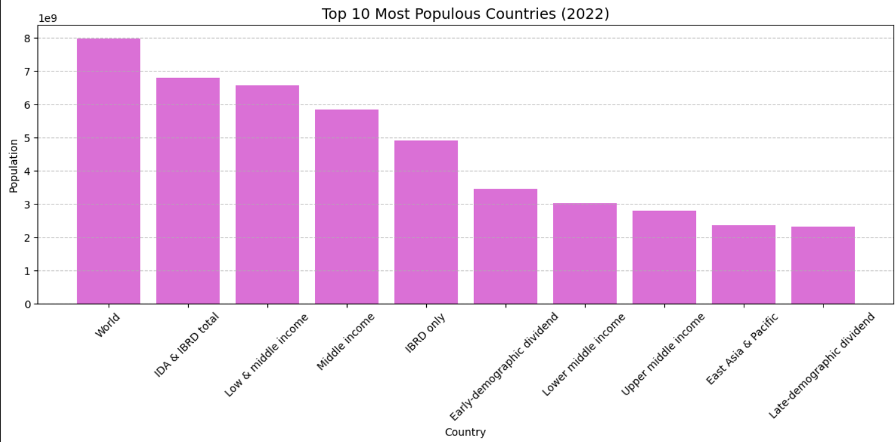

# PRODIGY_DS_01

## Task

Create a bar chart or histogram to visualize the distribution of a categorical or continuous variable.  
Using the World Bank population dataset, we visualize the population of selected countries for the year 2020.

## Files

- `script.py`: Python code to load data and generate the bar chart.  
- `output.png`: The generated bar chart image showing population distribution.  
- `README.md`: This file.

## How to run

1. Download the World Bank population CSV from:  
   https://data.worldbank.org/indicator/SP.POP.TOTL

2. Place the CSV file in the same directory as `script.py`.  
3. Run the script:  
   ```bash
   python script.py
## Output image


